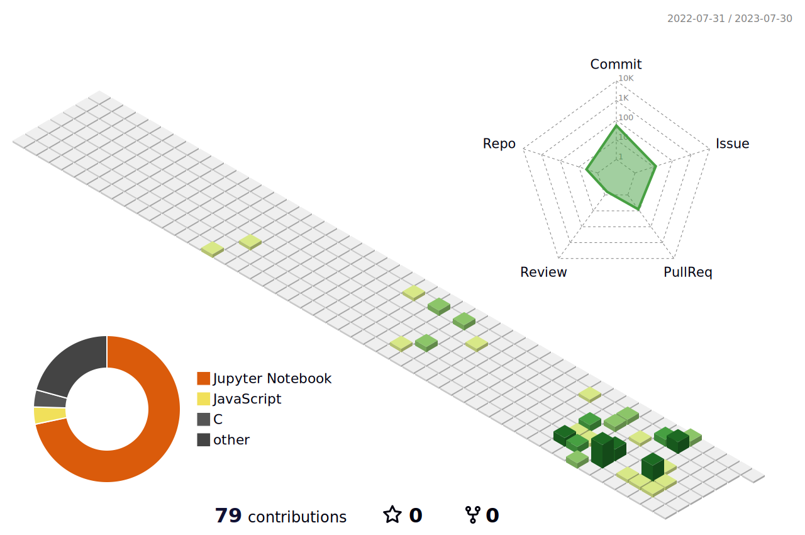

 <!-- https://polycount.com/discussion/210187/ue4-ghost-in-the-shell-majors-bedroom -->

I'm a bioinformatician student specializing in machine learning and algorithm programmation.   
I also like penguins 🐧.    

## Info

### Studies
- Bachelor in Biology @[**University of Montpellier**](https://biologie-mv-fds.edu.umontpellier.fr/licence-sciences-de-la-vie-new/)
- Bachelor in CS at @[**EPSI**](https://www.epsi-formations.pro/formation/concepteur-developpeur-dapplications/)
- Master in Bioinformatics at @[**University of Montpellier**](https://formations-en.umontpellier.fr/fr/formations/master-lmd-XB/master-bioinformatique-KKI9GZEV.html)

### Career
- Back-end engineer @[**Linxo**](https://www.linxo.com/)
- Trainee researcher @[**University of Sherbrooke**](https://www.usherbrooke.ca/)
- Trainee researcher @[**IGMM/LIRMM/IMAG**](https://www.igmm.cnrs.fr/service/equipe-igmm-lirmm-imag-regulations-genomiques-computationnelles/)
  
### Miscellaneous
- Current code editor:  

<!--
**JulienRaynal/JulienRaynal** is a ✨ _special_ ✨ repository because its `README.md` (this file) appears on your GitHub profile.

Here are some ideas to get you started:

- 🔭 I’m currently working on ...
- 🌱 I’m currently learning ...
- 👯 I’m looking to collaborate on ...
- 🤔 I’m looking for help with ...
- 💬 Ask me about ...
- 📫 How to reach me: ...
- 😄 Pronouns: ...
- ⚡ Fun fact: ...

## Stats
:-----------------------------:|:-----------------------------:

-->
